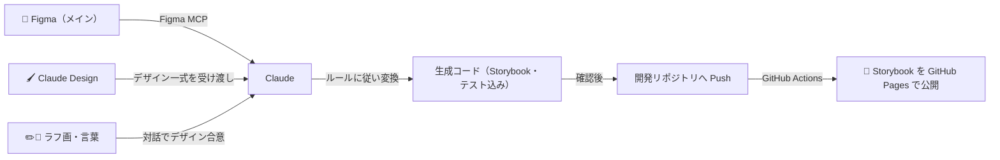

# Airis - デザイナースターターキット w/ ClaudeCode

Airis（アイリス）は、デザイナーが Claude Code と対話しながらデザインをコードにするためのスターターキットです。

Figma のデザイン・手描きのラフ画・会話での要望のどれからでも、プロジェクトで定めたルールに沿ったコード（Storybook・テスト込み）を生成し、開発リポジトリまで届けます。

必要なのは**このリポジトリと Claude Code だけ**。デザインの伝え方は自由です:

- 🎨 **Figma を使う** — 既存の Figma デザインをそのままコード化（**メインの使い方**）
- 🖌️ **Claude Design を使う** — claude.ai/design で作り込んだデザイン一式を受け取ってコード化。Figma/ラフ画で始めて途中から確認・作り込みに使うのも OK
- ✏️ **ラフ画を渡す** — 手描きスケッチの写真やスクリーンショット（ローカル画像）から「こんなのを作って」
- 💬 **言葉で伝える** — 「こういう画面が欲しい」→ Claude がデザインを提案 → 合意してからコード化

Figma がメインですが、**Figma 無しでも全フローが完結**します（Figma 以外のデザインツールは要りません）。

生成結果を Figma に取り込んで手直しすること（コード→Figma の還流）も、HTML→Figma 取り込みプラグイン経由で可能です（フロー中に Claude が案内します）。

---

## クイックスタート

### 1. 必要なもの

- Git
- [Node.js](https://nodejs.org)（**v22 以上**。トークン変換に使う style-dictionary v5 の動作要件）
- [Claude Code](https://claude.com/claude-code)（`npm i -g @anthropic-ai/claude-code`）
- [GitHub CLI](https://cli.github.com)（`gh`。Claude が代わりにコミット・Push・Pull Request 作成を行うために使います。`/setup` でログイン手順を案内します）

Figma を使う場合のみ、次のどちらかを追加で用意（`/setup` が案内します）:

- **公式 Dev Mode**: Figma デスクトップアプリ + 環境設定で「Enable local MCP Server」を有効化（Dev/Full シートが必要）
- **Framelink**: Figma の [Personal access token](https://www.figma.com/settings)（無料プランでも可）

### 2. インストール → Claude 起動

ターミナルで 1 行実行すると、前提チェック〜取得〜依存の導入まで自動で行います:

```bash
curl -fsSL https://raw.githubusercontent.com/tu0607/airis-designer_cc_toolkit/main/install.sh | sh
```

```bash
cd airis        # インストール先（AIRIS_DIR=<名前> で変更可）
claude          # Claude Code を起動
```

> - リポジトリが非公開なら、先に `gh auth login` を済ませてください。
> - **更新も同じコマンドです。あなたが編集したファイルは上書きされません**（[更新のしかた](docs/repo-structure.md)）。

### 3. セットアップ

```
/setup
```

前提確認と作業ディレクトリの準備を対話で行います。**何度実行しても安全**（冪等）。
Figma 接続はここで聞かれますが、**使わないならスキップで OK**（後から再実行して追加できます）。

### 4. デザインをコード化

```
/design-to-code
```

あとは Claude が対話しながら進めます。要望や Figma URL を直接渡すこともできます:

```
/design-to-code ログイン画面を作りたい。メールとパスワードでログイン、パスワード忘れリンク付き
/design-to-code https://www.figma.com/...
```

> Push など外部に影響する操作は、必ず事前に確認します。勝手に push されることはありません。

**何を聞かれ、どう進むのか**は [使い方の詳細](docs/usage.md) に 1 ステップずつ書いてあります。

---

## 仕組み



### 全体の流れ（トークン → コード → テスト → 継続運用）

| 工程 | 内容 | 担当 |
| --- | --- | --- |
| ① 対象の確定 | Web / ネイティブ、Web なら 3 ターゲットのどれかを決める → 移植先リポジトリを取得 | Claude が提示 / **判断はあなた** |
| ② トークン化 | Figma の Variables/Styles（または合意したデザイン）を DTCG 形式の JSON にする + 「値 → トークン名」の対応表を作る | **4 つから選択**（[取り出し方](docs/design-tokens.md)） |
| ③ 変換 | 正本 JSON（core → mode/default → 有効モードの順に結合）→ `styles/tokens.css`（`@theme`）・ネイティブテーマ | **Style Dictionary**（機械変換・冪等） |
| ④ 診断 | 設定の不備・設計の抜け・**技術との不一致**（Tailwind スケール等）を一覧化し、直し方を提示 → **進め方をあなたが決める** | Claude が提示 / **判断はあなた** |
| ⑤ コード生成 | コンポーネント + Storybook ストーリー + E2E 雛形を `rules/` 準拠で生成（Push 先の作業ツリーへ直接） | Claude |
| ⑥ セルフチェック | 生成物がルールに従えているかを静的検査（+ 型検査）→ ERROR は Push 前に修正 | Claude（`scripts/selfcheck.mjs`） |
| ⑦ Push | 差分を確認 → コミット・Push・**Pull Request 作成**（トークンも同じ PR） | Claude（`git` / `gh` 経由） |
| ⑧ テスト・公開 | ①コンポーネント ②ストーリー ③VRT の 3 層テスト → **Storybook を GitHub Pages へ公開**（デザイナーは URL で確認） | GitHub Actions |
| ⑨ 継続運用 | トークン変更をトリガーに CI が再ビルド・テスト・再公開 | GitHub Actions |

> **なぜこの順番か** — ④ の診断を前倒しすると「この余白は Tailwind のスケールに乗らない」といった**技術との不一致が検査できません**（使う技術もトークンも決まっていないため）。だから ① で作るものと移植先を決め、②③ でトークンを固めてから診断します。
>
> **Push の前にローカルでテストを回すことはしません。** 検査は ⑧ の GitHub Actions が、見た目の確認は公開された Storybook が担います。手元で二重に検証すると、それだけで待ち時間が増えるためです。

### Airis が「勝手にやらない」こと

トークンの値を増やす／共通層に置く／VRT 対象に加える／**Figma 側の設定不足を補完する**。
いずれも**候補を報告するだけで、判断はあなたがします**。

---

## もっと詳しく

| ドキュメント | 何が書いてあるか | いつ読むか |
| --- | --- | --- |
| [使い方の詳細](docs/usage.md) | `/design-to-code` の進み方・Claude のコマンド | 最初の 1 回を進めるとき |
| [トークンの取り出し方](docs/design-tokens.md) | Figma から DTCG JSON にする 4 つの方法・継続運用のループ | `/setup` で方法を選ぶとき |
| [デザインシステムの考え方](docs/design-system.md) | Core / product / mode の層構造・共通層への昇格 | トークン設計を決めるとき |
| [テストと公開](docs/testing-and-publishing.md) | テスト 3 層・ワークフロー・**Storybook の公開範囲** | Push 先を用意するとき |
| [生成コードの技術スタック](docs/tech-stack.md) | 3 ターゲットの振り分けと採用技術 | 実装者に渡すとき |
| [リポジトリ構成とカスタマイズ](docs/repo-structure.md) | ディレクトリの中身・`rules/` の編集方針 | ルールを自社向けに直すとき |
| [困ったときの対処](docs/troubleshooting.md) | よくある症状と対処 | 詰まったとき |

変換ルールの「正」は [`rules/`](rules/README.md)、フロー全体の「正」は [`CLAUDE.md`](CLAUDE.md) です。

---

**Airis = AI + Iris。**
虹の女神 Iris が神々の言葉を届けたように、デザイナーの閃きを素早くエンジニアの世界へ届けます🌈
