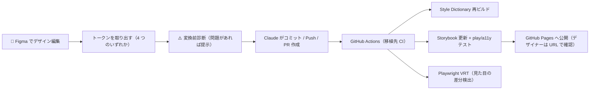

# Figma からトークンを取り出す 4 つの方法

**どれが正解ということはありません。**環境（プラグインを入れられるか）と頻度（継続的に更新するか）で選びます。`/setup` で選択し、後から何度でも変更できます。

| 方法 | どうやる | 向いている場面 | 用意するもの |
| --- | --- | --- | --- |
| **Tokens Studio + GitHub 連携** | プラグインの Push ボタンで GitHub へ送る（コミットと PR が作られる） | デザインを継続的に更新していく | プラグイン + GitHub トークン |
| **自作プラグインで書き出す** | 社内の Figma プラグインで JSON を書き出し、Claude に渡す | 社内プラグインがある。独自の命名規則がある | 自作プラグイン。**Airis 同梱のものが 1 つあり**（`figma-plugin/`）、`sh figma-plugin/setup.sh` だけで使えます |
| **既製プラグインで書き出す** | TokensBrücke などで JSON を書き出し、Claude に渡す | 単発・小規模。導入は最小限にしたい | 無料プラグイン 1 つ |
| **Claude Code が読み取る** | プラグインなしで、Claude が Figma から直接読み取って作る | プラグインを入れられない。まず試したい | **Dev Mode 接続**（下記の注意） |

> 🔑 **反映（コミット・Push・PR 作成）はどの方法でも Claude Code が代行します。** トークンは生成コードと**同じ Pull Request** に入るので、**GitHub の画面でファイルをアップロードする作業はありません**（Push 直前に必ず確認を取ります）。例外は **Tokens Studio** だけで、プラグインの **Push ボタン**がトークン用の PR を作ります（触るのは Figma プラグイン内だけ）。
>
> 📋 **書き出した JSON は使い切ります。** ① スタイルの実体（`styles/tokens.css`）の生成と ② 「どの値がどのトークンになったか」の対応表の作成の**両方**に使われ、コードのクラス名はその対応表からだけ決まります（Figma の生の色コードが直接書かれることはありません）。
>
> ⚠️ **「Claude Code が読み取る」は Dev Mode 接続が前提**です。Framelink だけの場合 **Variables（変数）は読めません**（API から読むには Figma の Enterprise プランが必要）。変数を確実に持ち出したいならプラグイン方式（上の 3 つ。プラン制限を受けません）か Dev Mode を選んでください。また Claude の解釈が入るので**作った後に名前と値を一緒に確認**します。Variables を使わず色を直接指定した箇所は拾えませんが、**勝手に名前を付けて埋めることはせず**変換前診断で一覧を返します。

## 継続運用のループ例

トークンがリポジトリに入った後は、どの方法でも同じです。

> Tokens Studio を選んだ場合は、**Push ボタンがそのままコミット + PR 作成**になります（トークンの PR がコードとは別に立ちます）。
> 「Figma で編集しただけで自動コミット」までの完全自動化は、Figma の Webhook（Organization/Enterprise プラン）+ Variables REST API（Enterprise）が必要です。

**変換ルールの詳細**（正本 JSON の構造・命名・逆引き表）は [`rules/common.md`](../rules/common.md) §2、フロー上の判断は [`CLAUDE.md`](../CLAUDE.md) ステップ 6 が正です。
