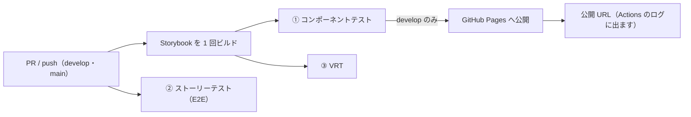

# テストと公開（すべて GitHub Actions）

生成されたコンポーネントの確認は、**公開された Storybook の URL** で行うのが既定です。ローカルで Storybook を起動する必要はありません。
テストは 3 層あり、**どれも GitHub Actions で自動実行**されます（手元でコマンドを打つ必要はありません）。実装の詳細は [`rules/web-app-testing.md`](../rules/web-app-testing.md)。

> 以下は **Web アプリ / コンテンツサイト** の構成です。**LP（Astro）は部品カタログを作らない**ため、Storybook の公開は行わず、テストは ②③（ページの E2E と見た目のチェック）だけになります。

| 層 | 何を守るか | 実装 |
| --- | --- | --- |
| ① **コンポーネントテスト** | 部品が単体で正しく動く・使える | `@storybook/test-runner`（play + a11y） |
| ② **ストーリーテスト** | 画面で「できること」（受け入れ基準） | `@playwright/test`（E2E） |
| ③ **VRT** | 見た目が意図せず変わっていない | `@playwright/test`（Storybook のストーリーを撮影。昇格済み部品のみ） |

- Push 時に、Claude がワークフローの雛形を移植先向けに提案します（既存 CI がある場合は上書きせずマージ提案にとどめます）:

  | ファイル | 役割 |
  | --- | --- |
  | `storybook-test-and-publish.yml` | Storybook を**1 回だけ**ビルド → ① 部品の検査 / ③ 見た目の検査 → 公開 |
  | `story-test.yml` | ② 画面のできることを検査 |
  | `vrt-baseline-update.yml` | ③ の見本画像を手動で更新（→ PR 起票） |
  | `design-tokens-build.yml` | トークン → CSS の変換結果を検査 |

- **Storybook のビルドは全体で 1 回だけ**。同じ成果物を ①③ の検査と公開が使い回すため、①③ と公開は 1 ファイルにまとまっています。どの層で落ちたかは**ジョブ名**（① `component-test` / ② `story-test` / ③ `visual-regression-test`）で分かります
- **公開されるのは開発ブランチ（既定 `develop`）の内容**＝「これから出るもの」を常に確認できる状態にします。PR 段階ではテストだけが走ります
- **① が通ったときだけ公開**します（カタログの中身は部品なので、公開可否は ① で判断）。**③ VRT の失敗では公開を止めません**（「見た目が変わった」は不具合とは限らず、公開して見比べて判断するため）
- **③ VRT の対象は「昇格した部品」だけ**なので、**導入直後は対象ゼロ**です（緑のまま何も比較しません）。対象を増やすのは人の判断で行います
- **初回だけ人の作業が必要**: リポジトリの **Settings → Pages → Source を「GitHub Actions」**に設定してください（**Claude が GitHub の設定画面での操作をお願いする唯一の例外**です。Claude 側では実行できないため）。`/setup` と Push 時に、手順と管理者への依頼文を Claude が案内します（**リポジトリに手順書ファイルは作りません**。案内は PR 本文とチャットで行います）

## 公開範囲に注意（誤解の多いところ）

**「Private リポジトリだから安全」とは限りません。** Pro / Team プランでは**リポジトリが非公開でもサイトだけは誰でも見られます**。認証をかけられるのは **Enterprise Cloud** の access control だけです。

| リポジトリ | プラン | カタログを見られる人 |
| --- | --- | --- |
| Public | 任意 | **誰でも**（検索に載る可能性あり） |
| Private / Internal | Free | Pages 自体が使えない |
| Private / Internal | **Pro / Team** | **誰でも** ← ここが罠 |
| Private / Internal | **Enterprise Cloud**（access control 有効） | read 権限のある**サインイン済みの人だけ** |

- 自分の環境は `gh api repos/<owner>/<repo>/pages --jq '{public, html_url}'` で確認できます（`public: false` → read 権限のある人だけ / `true` → 誰でも / 404 → Pages 未設定）。GUI なら **Settings → Pages** に「Visibility」欄があるかどうか（**欄が無い = そのプランでは制限できない**）。`/setup` と Push 時に Claude も確認して伝えます
- 🔗 **公開 URL は環境で変わります**: access control が有効なら `<org>.github.io/<repo>/` ではなく **`<ランダムな名前>.pages.github.io`**（推測されないためのホスト名で、これが認証が効いている証拠）。実際の URL は上の `html_url` で確認してください
- Pages が使えない場合は `storybook.publish` を `artifact` にすると、Actions の実行画面から Storybook をダウンロードして開く形になります（`none` で公開なし）
- **実行コストが気になる場合**（Private リポジトリでは Actions の実行時間が課金対象）: `testing.vrtBranches` を `["main"]` にして、VRT を本番ブランチだけに絞れます
